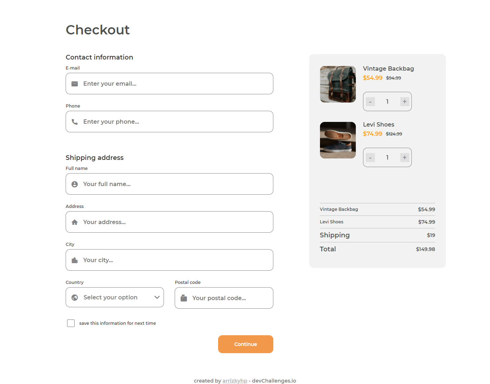

<!-- Please update value in the {}  -->

<h1 align="center">Checkout Page</h1>

   Solution for a challenge from  <a href="http://devchallenges.io" target="_blank">Devchallenges.io</a>.

  <h3>
    <a href="https://arrizkyhp.github.io/dc-checkout-page/">
      Demo
    </a>
     | 
    <a href="https://devchallenges.io/solutions/KstiBhNedAsZjtJ3gLAu">
      Solution
    </a>
     | 
    <a href="https://devchallenges.io/challenges/0J1NxxGhOUYVqihwegfO">
      Challenge
    </a>
  </h3>

<!-- TABLE OF CONTENTS -->

## Table of Contents

- [Overview](#overview)
  - [Built With](#built-with)
- [Features](#features)
- [Contact](#contact)
- [Acknowledgements](#acknowledgements)

<!-- OVERVIEW -->

## Overview

[📱 Mobile Version](./mobile.png)

### Built With

- Html
- Css
- JavaScript

## Features

<!-- List the features of your application or follow the template. Don't share the figma file here :) -->

This application/site was created as a submission to a [DevChallenges](https://devchallenges.io/challenges) challenge. The [challenge](https://devchallenges.io/challenges/0J1NxxGhOUYVqihwegfO) was to build an application to complete the following user stories:

- [x] User story: I can see a page following the given design.
- [x] User story: I can input email, phone, full name, address, city, country, and postal code.
- [x] User story: I can input the number of items.
- [x] User story: I can select at least 3 countries from the dropdown.
- [x] User story: When I click submit button or press enter, I can see a warning if validation fails.
- [x] User story: When I click submit button or press enter, I can see a successful alert if validation succeeds.

## Acknowledgements

<!-- This section should list any articles or add-ons/plugins that helps you to complete the project. This is optional but it will help you in the future. For exmpale -->

- [Steps to replicate a design with only HTML and CSS](https://devchallenges-blogs.web.app/how-to-replicate-design/)
- [Email Validation](https://www.w3resource.com/javascript/form/email-validation.php)
- [JavaScript Form Validation](https://www.w3schools.com/js/js_validation.asp)
- [How to change select dropdown arrow in CSS](https://www.heapcoding.com/how-to-change-select-dropdown-arrow-in-css/)
- [Jquery Increment / Decrement Input value](https://jsfiddle.net/zuul/7zxLz9nw/)
- [onchange event for input type="number"](https://stackoverflow.com/questions/9609731/onchange-event-for-input-type-number)
- [HTML5 placeholder css padding](https://stackoverflow.com/questions/4919680/html5-placeholder-css-padding)

## Contact

- GitHub [@arrizkyhp](https://github.com/arrizkyhp/})
- Twitter [@arrizkyhp](https://twitter.com/arrizkyhp})
